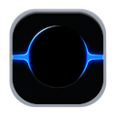
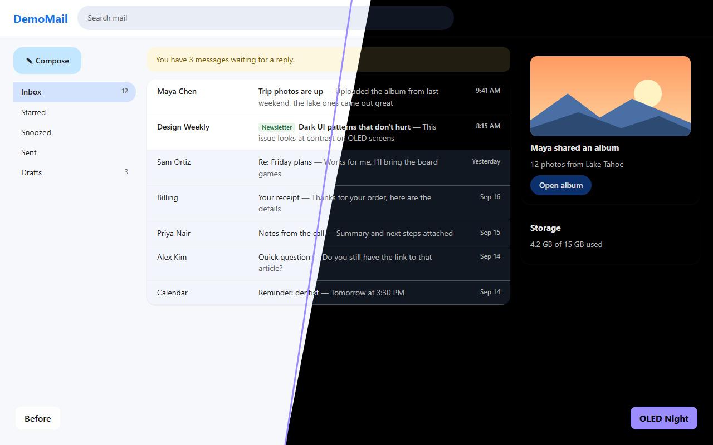
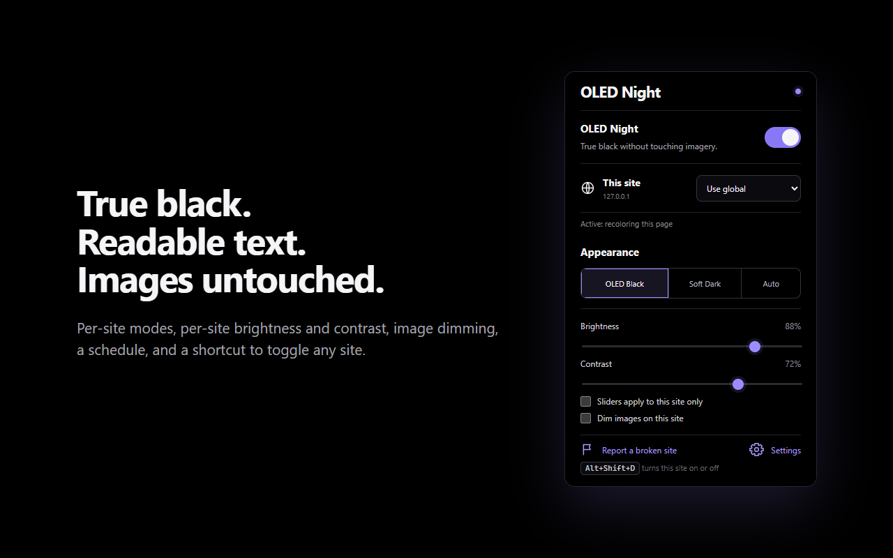

<p align="center"></p>

<h1 align="center">OLED Night</h1>

<p align="center"><b>True-black dark mode for every website, without breaking it.</b><br>
Free and open-source Chrome extension � Firefox desktop preview · readable text · images untouched · per-site control</p>

<p align="center">
  <a href="https://github.com/bc1224/oled-night/releases/latest/download/oled-night.zip"><b>Download latest ZIP</b></a> ·
  <a href="https://chromewebstore.google.com/detail/oled-night/afffgalhockmjmknnaljghdneaeichbl">Chrome Web Store extension</a> ·
  <a href="https://chromewebstore.google.com/detail/oled-night-chrome-theme/pkdklfocgpcnijiggfddneadmhacbpmf">Chrome Web Store theme</a> ·
  <a href="https://bc1224.github.io/oled-night/">Website</a> ·
  <a href="INSTALL.md">Install guide</a> ·
  <a href="https://github.com/bc1224/oled-night/issues">Report a site</a>
</p>



## Why
I've got an OLED monitor, and I wanted every site to be black. Not dark grey. Actually black, so the pixels are off.

Every dark mode extension I tried either left everything grey, or made sites dark and broke them: text I couldn't read, random white boxes, weird white gradients around chat boxes, charts turning into blank white shapes, Amazon photos turning into black squares. Some even made Gmail and ChatGPT lag. So I made my own. Every time a site broke, I fixed it and added a test so it stays fixed.

## Features
- **True `#000` black backgrounds.** Cards and panels keep a subtle lift so layouts stay readable.
- **Images untouched.** Photos, video and art keep their colors. Image dimming is optional.
- **Readable text, with emphasis kept.** Primary, secondary and muted text stay distinct, and Gmail's read and unread emails stay easy to tell apart.
- **Respects dark sites.** On a site that's already dark, it only deepens its greys to true black.
- **Modern web apps.** Charts, web components, embedded chat widgets and frames, and modern CSS colors (`oklch`, `lab`, `color()`).
- **No white flash, and no lag.** Pages go black before they draw, and updates are batched.
- **Per-site modes:** automatic, full recolor, deepen blacks only, invert (canvas apps), or off. Each site can also have its own brightness, contrast and image dimming.
- **Schedule, keyboard shortcut (<kbd>Alt</kbd>+<kbd>Shift</kbd>+<kbd>D</kbd>), settings backup, and a "report a broken site" button.**
- **Private.** No servers, no analytics, no tracking. See the [privacy policy](store/PRIVACY.md).

## Install
Install the [OLED Night extension](https://chromewebstore.google.com/detail/oled-night/afffgalhockmjmknnaljghdneaeichbl) from the Chrome Web Store. For a matching black browser window, install the [OLED Night Chrome theme](https://chromewebstore.google.com/detail/oled-night-chrome-theme/pkdklfocgpcnijiggfddneadmhacbpmf) too. Store installs update automatically.

**Manual install:**
Download [`oled-night.zip`](https://github.com/bc1224/oled-night/releases/latest/download/oled-night.zip), unzip it into a folder you'll keep, open `chrome://extensions`, turn on **Developer mode**, and click **Load unpacked** on that folder. Full steps, including Edge and updating, are in [INSTALL.md](INSTALL.md). To hear about new versions, click **Watch → Custom → Releases** at the top of this page.

**Want Chrome itself black too?** The extension darkens websites, but only a theme can change Chrome's own window. Grab [`oled-night-theme.zip`](https://github.com/bc1224/oled-night/releases/latest/download/oled-night-theme.zip) and load it the same way. See [theme/README.md](theme/README.md).

**Firefox desktop:** A Firefox preview ZIP is available in GitHub releases and CI artifacts. See [Firefox installation](FIREFOX.md). It currently installs temporarily for testing; the Mozilla Add-ons submission is awaiting review. The Chrome theme is not compatible with Firefox.

## Using it
Click the toolbar icon on any site:



| Site mode | What it does |
|---|---|
| Use global | Follows the main switch |
| On (automatic) | Recolors light sites; on dark sites, only deepens their blacks |
| Full recolor | Always recolors, even if the site looks dark |
| Deepen blacks only | Only pushes the darkest greys to true black |
| Invert | For canvas apps (Sheets, Figma): flips the page, then flips images back |
| Off | Never touches the site |

If a site still looks wrong, click **Report a broken site** in the popup and [open an issue](https://github.com/bc1224/oled-night/issues/new) with the saved file and a screenshot.

## How it works
OLED Night doesn't run one filter over the whole page. It works out a color for each element on its own: backgrounds, text, borders, SVG icons, chart fills, gradients, shadows and `::before`/`::after`. It keeps each text's original emphasis and remembers what was originally behind it. Every update reads all the styles it needs first and writes the changes after, so a batch costs a single style recalculation. Brightness and contrast are CSS variables, so moving a slider never re-scans the page.

| File | Role |
|---|---|
| `settings.js` | Shared settings model: defaults, site modes, per-site tuning, schedule |
| `color-utils.js` | Color parsing (every CSS color syntax) and mapping rules |
| `content.js` | Page engine: batched recoloring, change tracking, shadow roots, invert mode, reports |
| `background.js` | Keyboard shortcut and the experimental closed-component option |
| `popup.*`, `options.*` | Toolbar popup and settings page |
| `docs/` | The project website (GitHub Pages) |

## Development
No build step. Load the folder with **Load unpacked**, then:
```
for t in tests/*.test.js; do node "$t"; done   # unit tests
node tests/e2e/run.mjs                          # real extension in headless Chrome, 46 checks
node tools/package.mjs                          # dist/ zips for the extension and the theme
node tools/store-assets.mjs                     # screenshots for the README and website
```
See [CONTRIBUTING.md](CONTRIBUTING.md) and [CHANGELOG.md](CHANGELOG.md).

## License
[GPL-3.0](LICENSE). You're free to use, study, change and share OLED Night. If you distribute a modified version, or charge for it, you must release its full source code under the same license and keep the original credit. Copyright © 2026 Brandon (bc1224). Versions up to 0.6.3 were released under MIT.
